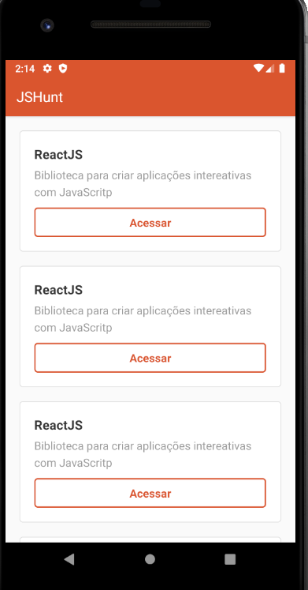
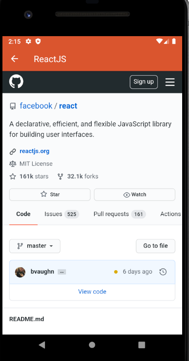

<h1 align="center">
    
</h1>

<p align="center">
  <a href="#rocket-tecnologias">Tecnologias</a>&nbsp;&nbsp;&nbsp;|&nbsp;&nbsp;&nbsp;
  <a href="#-projeto">Projeto</a>&nbsp;&nbsp;&nbsp;|&nbsp;&nbsp;&nbsp;
  <a href="#-como-rodar">Como rodar</a>&nbsp;&nbsp;&nbsp;|&nbsp;&nbsp;&nbsp;
  <a href="#-como-contribuir">Como contribuir</a>&nbsp;&nbsp;&nbsp;
  </p>
<p align="center">
 
</p>

<br>

<h1 align="center">
    
</h1>

<h1 align="center">
    
</h1>

## Hunt App - React-native

## 🚀 Tecnologias

Esse projeto foi desenvolvido com as seguintes tecnologias:

- [React](https://pt-br.reactjs.org/) - v16.13.1
- [Yarn](https://yarnpkg.com/) - 1.22.4
- [Npm](https://www.npmjs.com/) - 6.14.5


## 💻 Projeto

O Hunt é um projeto em react-native que ler um API e mostra seu conteudo em tela. 

[API](https://github.com/jamangueira7/node-rocketseat).

## 🚀 Como Rodar


- Clone o projeto.
- Entre na pasta do projeto e rode yarn install (pode usar npm install de acordo com a sua configuração).
- Caso tenha problema com a conexão tente:
```
adb reverse tcp:3333 tcp:3333
```
- yarn android.

Para rodar o emulador do Android ou iOS siga o guia da Rocketseat.

## 🤔 Como contribuir

- Faça um fork desse repositório;
- Cria uma branch com a sua feature: `git checkout -b minha-feature`;
- Faça commit das suas alterações: `git commit -m 'feat: Minha nova feature'`;
- Faça push para a sua branch: `git push origin minha-feature`.

Depois que o merge da sua pull request for feito, você pode deletar a sua branch.

